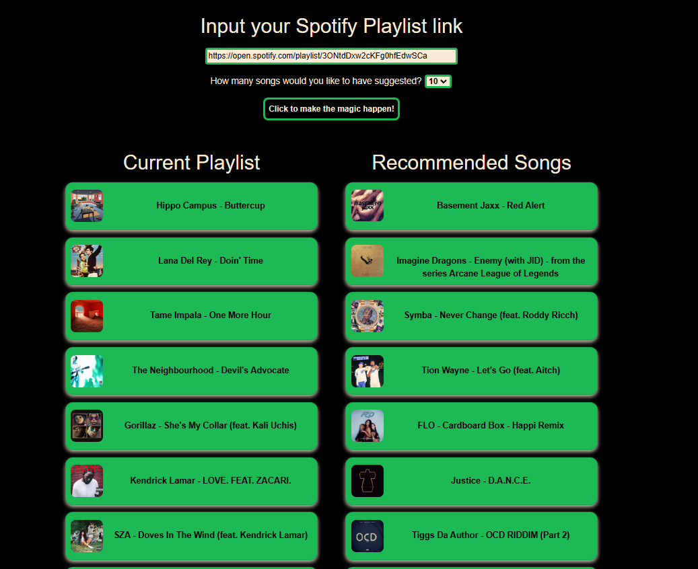

spoti-find.herokuapp.com


# **Spoti-Find**
#### By Zach Evans, Carolyn Johnson, David Ma, Yonas Michael, Dejan Savic, Wendell Killette Jr.
***
## **Project Description:**
We constructed a song recommendation system to help induividuals add songs to favorite playlists. Using spotify API and user-friendly Spotipy, machine learning models were created to be the back bone to the recommendation system; a continuously learning model which gets better time. 

## Project Outline
1. Set up developer account to **access Spotify API credentials**; making API calls to retrieve necessary data. 
   
   [Spotipy](https://spotipy.readthedocs.io/en/2.22.0/)
   
   [Spotify for Developers](https://developer.spotify.com/)
   
2. Take into consideration the **data most useful** for our purposes.
3. Make the data API calls to **retrieve your data**.
```python 
def extract_user_playlist(url):
    # Split the url and use Spotipy to retrieve the track information for each song in the playlist
    playlist_url = url.split("/")[4].split("?")[0]
    playlist_tracks = sp.playlist_tracks(playlist_url)

    # For loop to extract the necessary track information
    track_ids = []
    track_titles = []
    track_artist = []
    track_album_art = []
    track_album_url = []

    for track in playlist_tracks['items']:
        track_ids.append(track['track']['id'])
        track_titles.append(track['track']['name'])
        track_album_art.append(track['track']['album']['images'][2]['url'])
        track_album_url.append(track['track']['album']['external_urls']['spotify'])
        artist_list = []
        for artist in track['track']['artists']:
            artist_list.append(artist['name'])
        track_artist.append(artist_list[0])

    # Create a dataframe from the track_ids to bring in features
    features = sp.audio_features(track_ids)

    features_df = pd.DataFrame(data=features, columns=features[0].keys())
    features_df['title'] = track_titles
    features_df['artist'] = track_artist
    features_df['album_art'] = track_album_art
    features_df['album_url'] = track_album_url
    features_df = features_df[['artist','title','album_url','album_art','id','danceability','energy','loudness','speechiness','acousticness','liveness','valence']]
    
    return features_df 
  ```
   

5. **Clean Data** and remove unnecessary information

```python
#function to turn artist genres string to list
def genre_list(self):
    split = self.strip().split(',')
    clean = [x.strip(" [']") for x in split]
    return clean
```

6. **Split the data** into training and test sets. You'll use the training set to train your model, and the test set to evaluate its performance.
7. **Extract features from the data**. Making sure the ML models can use the features
```python
feature_cols=['acousticness', 'danceability', 'duration_ms', 'energy',
              'instrumentalness', 'key', 'liveness', 'loudness', 'mode',
              'speechiness', 'tempo', 'time_signature', 'valence',
]

from sklearn.preprocessing import MinMaxScaler
scaler = MinMaxScaler()
normalized_df =scaler.fit_transform(data[feature_cols])
```


8. **Train a machine learning model**. We choose an appropriate model for your data and goals, such as a collaborative filtering model or a content-based recommendation system. You'll then need to train the model using the training data


9. **Evaluate the model's performance**. Use the test data to evaluate the model's performance in terms of metrics such as precision, recall, and F1 score. You may need to adjust the model's hyperparameters or try a different model if the performance is not satisfactory.


10. **Use the model to make recommendations**. Once you have a trained model, you can use it to make recommendations to users based on their input.
```python
# Create a pandas series with song titles as indices and indices as series values 
indices = pd.Series(data.index, index=data['song_name']).drop_duplicates()

# Create cosine similarity matrix based on given matrix
cosine = cosine_similarity(normalized_df)

def generate_recommendation(song_name, model_type=cosine ):
    """
    Purpose: Function for song recommendations 
    Inputs: song title and type of similarity model
    Output: Pandas series of recommended songs
    """
    # Get song indices
    index=indices[song_name]
    # Get list of songs for given songs
    score=list(enumerate(model_type[index]))
    # Sort the most similar songs
    similarity_score = sorted(score,key = lambda x:x[1],reverse = True)
    # Select the top-20 recommend songs
    similarity_score = similarity_score[1:21]
    top_songs_index = [i[0] for i in similarity_score]
    # Top 20 recommended songs
    top_songs=data['song_name'].iloc[top_songs_index]
    return top_songs
```


---
Ultimately, we were able to build his song recommendation web application through Python Flask. User provides a link to a spotify playlist. The application will take the playlist and begin requesting metric data on each song in this playlist to give us an idea of the genre of music. Additionally using the machine learning algorithms, user will get returned songs that are similar based on the initial playlist.




## Limitations
The use of of free API do have rate limits which reduced the datasets we could obtain.

If you would like to learn what [Python Flask](https://pythonbasics.org/what-is-flask-python/) is. Click on the link.


